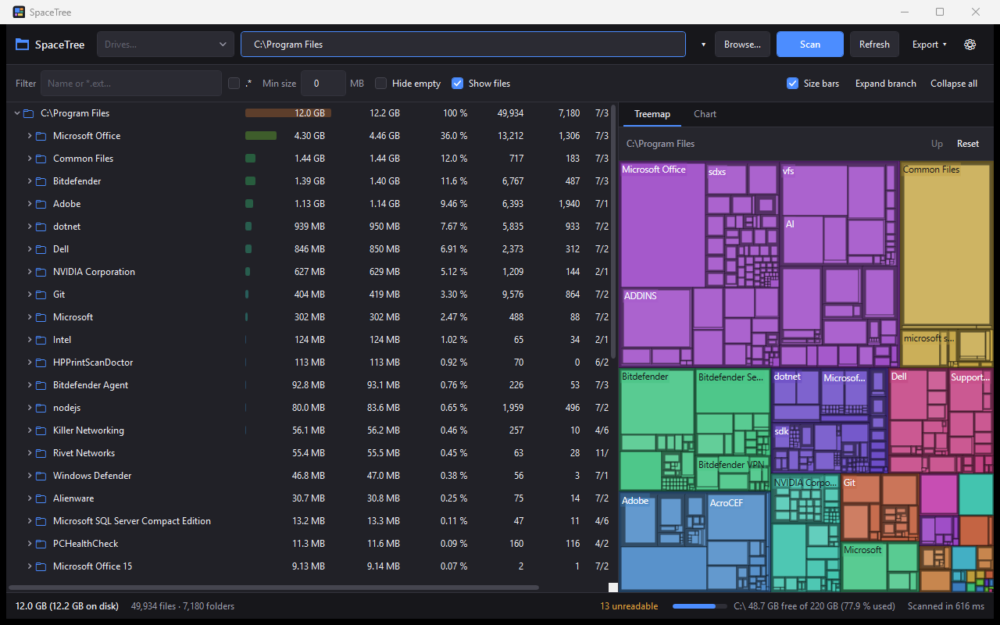
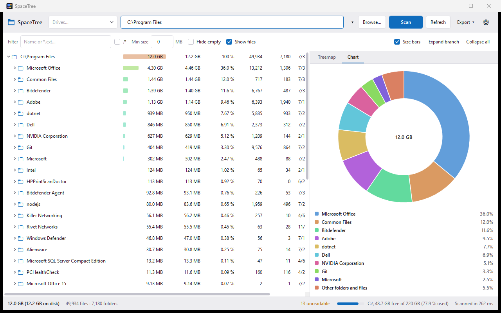

# SpaceTree

[](LICENSE)
[](https://dotnet.microsoft.com/download/dotnet/8.0)
[](#requirements)

A fast disk space analyzer for Windows. Point it at a drive or folder and it tells you
where the space went — as a sortable Explorer-style tree with proportional size bars, and
as an interactive treemap.



The scan above — 12 GB across 49,934 files and 7,180 folders — finished in 616 ms.
A 140,000-file tree takes around 660 ms on the same NVMe drive.

---

## Features

**Scanning**
- Any local drive, folder, or UNC path
- Multi-threaded parallel enumeration, thread count configurable (1–64, defaults to one per core)
- Live progress: files and folders scanned, throughput, current path, estimated time remaining
- Cancel at any point — partial results stay on screen and remain usable
- Full support for paths beyond the legacy 260-character limit
- Both **logical size** and **allocated size** (what the file actually occupies on disk,
  accounting for cluster rounding and NTFS compression)
- Per-folder file and subfolder counts, and the most recent modification time anywhere in the subtree
- Access-denied folders are recorded and listed rather than silently skipped

**Tree view**
- Virtualised list that stays responsive with hundreds of thousands of rows
- Columns: Name, Size, Allocated, % of Parent, Files, Folders, Last Modified
- Columns can be reordered by dragging, resized, and individually hidden; the layout persists
- Click any header to sort; sorting applies within each sibling group so the hierarchy stays intact
- Colour-graded proportional size bars behind the Size column — a cool blue for a small share
  through to warm orange for a folder dominating its parent
- Optional file rows, interleaved with folders in the active sort order
- Right-click: open, show in Explorer, copy path, zoom the treemap, delete, properties

**Visualisation**
- Interactive squarified treemap: hover for details, click to select and reveal in the tree,
  double-click to zoom in, Up/Reset to zoom out
- Donut chart of the largest items in the focused folder, with a legend
- Both update live while a scan is running

**Filtering**
- Quick filter with wildcards (`*.iso`, `log;tmp`) or full regular expressions
- Matching keeps the ancestors of a match visible, so you can see *where* the hits live
- Minimum-size threshold and a hide-empty-folders toggle

**Export**
- CSV (RFC 4180, UTF-8 with BOM so Excel handles non-ASCII names)
- Indented plain text
- Self-contained HTML report with inline styling and proportional bars
- Print, which doubles as PDF export via the built-in *Microsoft Print to PDF* printer

**Everything else**
- Dark and light themes, or follow the Windows setting
- Remembers window placement, split position, column layout, filter mode, units, and last scan path
- Drag a folder onto the window to scan it
- "Restart as administrator" for folders your current token cannot read
- Status bar with totals, item counts, volume free space, scan duration, and unreadable-folder count



---

## Requirements

- Windows 10 1809 or later (Windows 11 recommended)
- [.NET 8 SDK](https://dotnet.microsoft.com/download/dotnet/8.0) to build
- To *run* a published self-contained build, no runtime installation is needed

## Build and run

```sh
git clone <this-repo>
cd SpaceTree

dotnet build SpaceTree.sln -c Release
dotnet run --project src/SpaceTree.App -c Release
```

Optionally pass a path to scan on startup — this is what makes a "Send to" shortcut useful:

```sh
dotnet run --project src/SpaceTree.App -c Release -- "C:\Users"
```

### Publishing a single executable

```sh
dotnet publish src/SpaceTree.App -c Release -r win-x64 --self-contained true ^
  -p:PublishSingleFile=true -p:IncludeNativeLibrariesForSelfExtract=true
```

The result lands in `src/SpaceTree.App/bin/Release/net8.0-windows/win-x64/publish/SpaceTree.exe`.

### Tests

```sh
dotnet test SpaceTree.sln
```

137 tests covering the scanning engine, size and allocation arithmetic, long-path handling,
filtering, sort ordering, treemap geometry, and the exporters. The scanner tests build real
directory trees in `%TEMP%` and scan them — a mocked filesystem would not exercise the Win32
interop the engine is built on.

---

## Project layout

```
src/
  SpaceTree.Core/             No UI dependencies — usable from a console or a service
    Model/                    DirectoryNode, FileEntry, ScanOptions, ScanResult
    Native/                   Win32 interop and long-path helpers
    Scanning/                 DirectoryScanner, VolumeService
    Filtering/                NodeFilter (patterns), FilterIndex (subtree matching)
    Sorting/                  Column comparators
    Visualization/            Squarified treemap layout
    Export/                   CSV, text, and HTML writers
    Util/                     Size and duration formatting

  SpaceTree.App/              WPF front end
    ViewModels/               MainViewModel, TreeRowViewModel, flattened row collection
    Views/                    MainWindow, dialogs, dialog service
    Controls/                 Owner-drawn treemap and donut chart
    Services/                 Settings, theming, shell operations, elevation, printing
    Themes/                   Dark and light palettes, control styles
    Converters/               Size bars, indentation, visibility

tests/
  SpaceTree.Core.Tests/
```

The separation is strict: `SpaceTree.Core` references no WPF assemblies, and the view models
reach the window layer only through `IDialogService`. That is what keeps the scanning and view
logic testable without spinning up a UI thread.

---

## How it works

**Scanning.** A lock-free LIFO work stack is drained by N dedicated worker threads. Each
directory is read in 64 KB batches through `GetFileInformationByHandleEx(FileFullDirectoryInfo)`,
which returns the name, attributes, timestamps, logical size *and* allocated size for roughly
600 entries per syscall. Filesystems that do not implement that information class fall back to
`FindFirstFileEx` automatically.

Two choices here came from measurement rather than theory:

- Dispatch never blocks. Waking workers through a semaphore cost a kernel transition per
  directory and made the scanner 2.5× *slower* than a plain `Parallel.ForEach`. Workers now
  spin briefly on an empty stack, which is nearly free because the stack is rarely empty until
  the very end of a scan.
- Allocated size comes from the directory enumeration itself. Calling `GetCompressedFileSize`
  per compressed file doubled total scan time and was *less* accurate than the allocation size
  the filesystem already reports.

**Live results.** When a directory finishes, its totals are added to itself and every ancestor
with interlocked arithmetic. A reader on another thread therefore always sees a consistent — if
still growing — picture, which is what lets the UI show a real tree during the scan instead of a
spinner.

**Memory.** Files are stored as a value-type `FileEntry` in a flat array per directory. On a
full system drive there can be several million; making each a heap object would cost roughly
three times the memory and wreck GC pauses. View models are created lazily, only for the scan
root and the children of folders actually expanded.

**Reparse points.** Junctions and symbolic links are shown but not followed by default. They
point at content that is either already counted elsewhere or lives on another volume, and they
can form cycles. There is a toggle if you want the other behaviour.

**Deleting.** Deletion goes through the shell's `IFileOperation`, not the older
`SHFileOperation`. The old API silently truncates at `MAX_PATH`, which would be a data-loss
hazard in a tool whose whole purpose is finding the deeply-nested folders that got out of hand.
`IFileOperation` also handles the recycle bin, the progress UI, and elevation prompts correctly.

---

## Keyboard shortcuts

| Key | Action |
| --- | --- |
| `F5` | Rescan the current root |
| `Ctrl+O` | Browse for a folder |
| `Ctrl+F` | Focus the filter box |
| `Esc` | Cancel a running scan, otherwise clear the filter |
| `→` / `←` | Expand / collapse, or move to first child / parent |
| `Enter` | Toggle a folder, or open a file |
| `Ctrl+Enter` | Open the selected item |
| `Alt+Enter` | Properties |
| `Ctrl+C` | Copy the selected path |
| `Delete` | Delete the selected item (with confirmation) |
| `Ctrl+E` | Export to CSV |
| `Ctrl+P` | Print or save as PDF |

`Delete` and `Ctrl+C` are bound to the tree rather than the window, so they still edit text
normally while the path or filter box has focus.

---

## Settings

Stored as JSON at `%APPDATA%\SpaceTree\settings.json`, written atomically (temp file then
replace) so an interrupted save cannot corrupt it. Delete the file to reset to defaults.
Unhandled errors are appended to `%APPDATA%\SpaceTree\errors.log`.

---

## Known limitations

- Windows only. The scanner is built directly on Win32 directory enumeration, which is the
  reason it is fast; a cross-platform port would need a separate backend.
- PDF export goes through the print dialog rather than a bundled PDF library. This keeps the
  application dependency-free, at the cost of one extra dialog.
- Printed reports are capped at 4,000 rows. Use CSV for the complete listing.
- Deleting an item marks the view "out of date" rather than recomputing every ancestor total;
  press `F5` to get exact numbers again.
- Folders that cannot be read are excluded from totals. The count is shown in the status bar and
  the full list is one click away — check it before trusting a number, or rerun elevated.

---

## Contributing

Issues and pull requests are welcome. A few things worth knowing before you start:

- `SpaceTree.Core` must stay free of UI dependencies. If a change needs `System.Windows`, it
  belongs in `SpaceTree.App`.
- Anything with interesting logic — comparators, filters, geometry, formatting — goes in Core
  with a test. The scanner tests build real directory trees under `%TEMP%`; keep them that way
  rather than mocking the filesystem.
- Run `dotnet test SpaceTree.sln` before opening a PR.

## License

Released under the MIT License. See [LICENSE](LICENSE).
